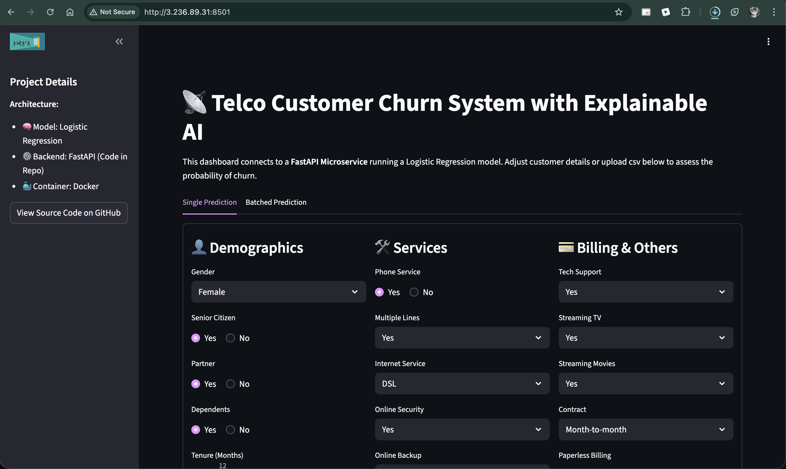

# 🚀 Full Stack ML Churn Prediction Microservice


An **end-to-end Machine Learning churn prediction system** designed for **real-world production deployment**.
This project goes beyond model training by implementing the **entire ML lifecycle**—from feature engineering and explainability to **Dockerized cloud deployment on AWS**, with a **FastAPI inference backend** and an interactive **Streamlit frontend**.
---
## [🔗 Demo](https://huggingface.co/spaces/harrykesh/ChurnPredictionDemo)

*app hosted on AWS EC2 instance.*
---

## 📚 Table of Contents

* [Architecture](#-architecture)
* [Key Features](#-key-features)
* [Tech Stack](#-tech-stack)
* [Project Structure](#-project-structure)
* [Getting Started Locally](#-getting-started-locally)
* [Docker Support](#-docker-support)
* [AWS Deployment Guide](#-aws-deployment-guide)
* [Synthetic Data Generation](#-synthetic-data-generation)
* [License](#-license)

---

## 🏗️ Architecture

The system follows a **microservices-style architecture** where the UI and inference engine are decoupled but packaged together for ease of deployment.

```sequenceDiagram
    participant U as User / Client
    participant S as Streamlit UI
    participant A as FastAPI Backend
    participant P as ML Pipeline
    participant M as Logistic Regression Model
    participant X as SHAP Explainer

    U->>S: Upload CSV / Enter Form Data
    S->>A: POST /predict
    A->>P: Load preprocessing pipeline
    P->>M: Run inference
    M-->>P: Prediction + Probability
    P->>X: Compute SHAP values
    X-->>A: Feature attributions
    A-->>S: JSON response
    S-->>U: Charts, Tables, Reports
```
---

## ✨ Key Features

### ⚡ Real-Time Inference

* Predict churn for individual customers
* Returns **probability scores**, not just binary labels

### 📦 Batch Processing

* Upload CSV files with **600+ records**
* Automatically validates schema and data constraints

### 🔍 Model Explainability

* Integrated **SHAP (SHapley Additive exPlanations)**
* Understand *why* a customer is predicted to churn

### 📊 Dynamic Visualizations

* Interactive **donut charts** (Safe vs. At-Risk customers)
* Downloadable prediction reports as CSV

### 🛠 Robust Data Pipeline

* Custom `FeatureEngineer` + `ColumnTransformer`
* Handles:

  * Missing values
  * Scaling
  * Categorical encoding
  * Schema enforcement

### ☁️ Cloud-Native & Production Ready

* Fully **Dockerized**
* Deployed on **AWS EC2**
* Images stored in **AWS ECR**
* CI/CD-ready design

---

## 🧰 Tech Stack

| Component        | Technology            | Description                                  |
| ---------------- | --------------------- | -------------------------------------------- |
| Model            | Scikit-Learn, XGBoost | Binary classification model (~80%+ roc_auc) |
| API              | FastAPI               | High-performance async inference backend     |
| Frontend         | Streamlit             | Interactive UI for business users            |
| Explainability   | SHAP                  | Local feature importance                     |
| Containerization | Docker                | Multi-platform (linux/amd64) builds          |
| Cloud            | AWS EC2, ECR          | Production deployment                        |

---

## 🗂 Project Structure

```
├── notebook/           # Jupyter notebooks (EDA & experiments)
├── sample/             # Synthetic sample datasets
├── src/                # Core source code
│   ├── components/     # Ingestion, transformation, training
│   ├── pipeline/       # Prediction pipelines
│   ├── utils.py        # Utility helpers
│   ├── logger.py       # Custom logging
│   └── exception.py    # Custom exception handling
├── Dockerfile          # Docker configuration
├── app.py              # FastAPI entry point
├── demo.py             # Streamlit UI connected to FastAPI backend API
├── streamlit_app.py    # Streamlit frontend
├── requirements.txt    # Python dependencies
└── README.md
```

---

## 🚀 Getting Started Locally

### 1️⃣ Clone the Repository

```bash
git clone https://github.com/yourusername/churn-prediction.git
cd churn-prediction
```

### 2️⃣ Create Virtual Environment

```bash
python -m venv .venv
source .venv/bin/activate      # macOS/Linux
# .venv\Scripts\activate       # Windows
```

### 3️⃣ Install Dependencies

```bash
pip install -r requirements.txt
```

### 4️⃣ Run the Application

**Backend**

```bash
uvicorn app:app --host 0.0.0.0 --port 8000
```

**Frontend**

```bash
streamlit run streamlit_app.py
```

* UI → [http://localhost:8501](http://localhost:8501)
* API Docs → [http://localhost:8000/docs](http://localhost:8000/docs)

---

## 🐳 Docker Support

This project includes a **production-ready Dockerfile**.

### Build Image

```bash
docker build -t churn-app .
```

### Run Container

```bash
docker run -p 8501:8501 -p 8000:8000 churn-app
```

---

## ☁️ AWS Deployment Guide

The application is deployed on **AWS EC2 (Ubuntu 24.04 LTS)** with Docker images stored in **AWS ECR**.

### 1️⃣ Push Image to AWS ECR

> **Important:**
> Mac M1/M2 (ARM64) → EC2 (AMD64) requires **multi-platform builds**.

```bash
# Authenticate
aws ecr get-login-password --region us-east-1 \
| docker login --username AWS --password-stdin <AWS_ACCOUNT_ID>.dkr.ecr.us-east-1.amazonaws.com

# Build for Intel architecture
docker build --platform linux/amd64 -t churn-app .

# Tag & Push
docker tag churn-app:latest <AWS_ACCOUNT_ID>.dkr.ecr.us-east-1.amazonaws.com/churn-app:latest
docker push <AWS_ACCOUNT_ID>.dkr.ecr.us-east-1.amazonaws.com/churn-app:latest
```

### 2️⃣ Deploy on EC2

```bash
docker pull <AWS_ACCOUNT_ID>.dkr.ecr.us-east-1.amazonaws.com/churn-app:latest
docker run -d -p 8501:8501 -p 8000:8000 <AWS_ACCOUNT_ID>.dkr.ecr.us-east-1.amazonaws.com/churn-app:latest
```

---

## 🧪 Synthetic Data Generation

To test **batch predictions**, a synthetic data generator is included.

```bash
python generate_data.py
```

* Produces `synthetic_churn_data.csv`
* 600+ realistic records
* Enforces domain constraints (e.g., service dependencies)

---

## 📝 License

This project is licensed under the **MIT License**.

---